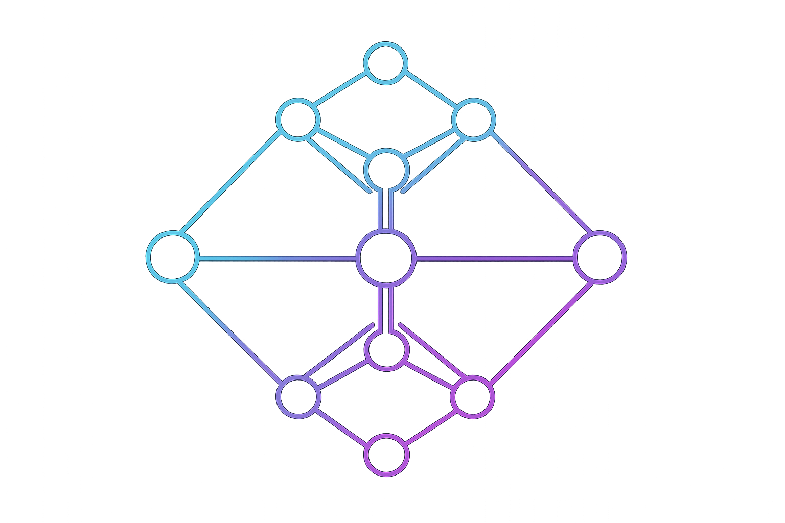

<p align="center">
  
</p>

# Diaspora
**A Universe of Graph Topology**

Diaspora is a formally verified exploration of Discrete Hodge Theory in Lean 4. It demonstrates how complex phenomena—conservation laws, energy quantization, topological defects, observation—emerge from a simple requirement: local perspectives on a discrete graph must form one consistent global reality.

---

## The Fundamental Problem: Perspectives That Must Agree

Imagine a network of observers. Each observer can only see their immediate surroundings - the connections touching them. Each one forms an opinion about how things should flow through their local connections.

You think three units should flow out.  
Your neighbor thinks five units should flow in.  
The wire between you hears both demands.

**The central question**: Can reality satisfy everyone simultaneously?

Usually, no. Local perspectives conflict. This mismatch - this impossibility of making everyone happy at once - is where everything interesting begins.

---

## The Misbuttoned Shirt: Where Energy Comes From

Imagine buttoning a shirt in the dark. You follow a simple rule: match each button to the hole right next to it. Every single pairing feels locally correct. Each button clicks into place satisfyingly.

But when you reach the collar, you discover you're off by one. There's a twist in the system.

**The crucial insight**: No individual button violates the local rule. Each one correctly followed the instructions. The error is **global** - it's a property of the whole chain, not any particular link.

You cannot fix this by adjusting individual buttons. You'd just move the problem around. The twist is stuck in the topology of the situation itself. Like a wrinkle in a fitted bedsheet that's slightly too large—you can smooth it down here, but it pops up over there. The excess is geometric fact.

Diaspora models energy as this twist—the measure of impossible demands, the distance between what local rules want and what global consistency allows. The twist (harmonic) and the flat configuration (gradient) live in separate dimensions of possibility-space. Conservation isn't a law imposed on the system—it's a theorem about dimensional separation.

---

## The Hodge Decomposition: The Great Separation

Every configuration of local demands splits uniquely into two parts:

**σ = dφ + γ**

- The **gradient part (dφ)** is what can be resolved by adjusting local perspectives. It's negotiable.
- The **harmonic part (γ)** is what's stuck in the topology. It's non-negotiable.

**The key property**: These parts are orthogonal. Completely independent. Living in separate dimensions.

Adjust perspectives all you want. You will **never** accidentally create or destroy the topological component. It's protected by geometry itself.

Diaspora formally proves this orthogonality: `⟨dφ, γ⟩ = 0`.

---

## Topological Genesis: How Closing a Loop Creates Energy

**Open topology** (a line of connected nodes): Every local demand can be satisfied. The system can relax to zero energy.

**Close the loop** (connect the endpoints): Suddenly, the same local demands become impossible to satisfy globally.

Energy appears from nowhere. Not because you added energy to the system, but because you **changed the topology**.

When perspectives form a circuit, their demands create a cycle of constraints. Go around the loop, and the constraints might not sum to zero. That excess becomes permanent circulation trapped in the topology.

---

## Quantization: The Spiral Staircase

Imagine a spiral staircase in a tall tower. To exit onto a floor, you must complete full loops. One circle → Floor 1. Two circles → Floor 2. **You cannot stop at 1.5 circles.** There's nowhere to stand.

Even though the climb feels smooth, the **stable states** are discrete. In a graph, you can't have 1.5 units of circulation because the path wouldn't connect back—you'd be left hanging in mid-air.

Energy levels jump in discrete steps because topology only allows integer windings.

---

## The Black Hole: Information Horizons From Structural Collapse

When an edge breaks:

1. **The topology changes** - you've created a hole
2. **Local details are destroyed** - the specific strain that caused the break is lost
3. **Global magnitude is preserved** - the energy becomes a permanent circulation

After a connection breaks, you know something broke here and how much energy was involved, but NOT the specific details of what broke or how.

Information is **compressed** - from high-dimensional local details into low-dimensional topological invariants.

---

## Interaction: Why Touching Isn't Talking

**One Bridge (Contact):** Flow requires a circuit. A single bridge provides no return path. The topology forces the flow to cancel itself out. The bridge is sterile.

**Two Bridges (Fusion):** A cycle can now leave World A, traverse World B, and return. A new harmonic form appears—a shared topological feature belonging to both.

**The Handshake Theorem:** To exchange information, two systems must topologically merge. Interaction is the creation of shared geometry.

---

## Self-Measurement: How a System Observes Its Own Topology

Send a probe around a loop tracking "which way is up." In flat space, it returns unchanged. Around a defect, it returns **rotated**.

The system detects the hole by **trying to pretend it's not there and failing**. Observation is the discovery of inconsistency—the system measures itself by noticing that local perspectives can't be made globally consistent.

---

## The Glassy Landscape: Multiple Possible Realities

In complex graphs with "frustrated" constraints (where demands can't all be satisfied), multiple stable configurations exist. A greedy algorithm (always fix the worst local problem) can trap the system in a high-energy false vacuum by addressing immediate pain while missing the global optimum.

When multiple stable configurations exist, history matters. The path taken determines which vacuum the system settles into.

---

## Metric Deception: The Lie of the Local

In a frustrated system, what "hurts" the most locally is often a lie.

**The Metric Deception Theorem** proves that the edge with the highest local strain ($\sigma$)—the one screaming to be fixed—can be a decoy. Meanwhile, the true structural weakness carries a lower local load but a higher *harmonic* burden ($\gamma$).

If you act on local information alone, you fix the wrong thing. You relieve the immediate tension but lock the global twist into a suboptimal configuration. To find the true defect, you cannot look at the edge; you must look at the loop.

-----

## Patience: Time as Computation

If you break edges the moment they become stressed (**Quenching**), you fall for the Metric Deception. You trap the universe in a false vacuum.

But if you wait (**Annealing**), the potentials $\phi$ have time to relax. They redistribute the load across the network. The stress profile physically moves, abandoning the decoy and accumulating on the true topological defect.

Diaspora proves that **Patience Saves the Universe**. Time is not just a parameter; it is a computational resource that solves the Hodge Decomposition, converting local confusion into global wisdom.

-----

## Topological Memory: The Universe Remembers

Because "Fast" evolution and "Slow" evolution break different edges, they result in graphs with different shapes.

  - **Quenched History:** Results in a cycle (no leaves).
  - **Annealed History:** Results in a tadpole graph (has a leaf).

This means the final topology isn't just a container for physics—it is a recording device. By checking if the universe has a "leaf" (a geometric feature), an observer can mathematically deduce how the system was cooled billions of steps ago.

Information about the past is stored in the connectivity of the present.

---

## Summary

First there are **perspectives** (local encodings). These perspectives must **coexist** (share a reality). The topology of their **connections** creates constraints. Those constraints force the emergence of **everything else**.

---

## How Diaspora Works

### The Setup
We model the universe using two types of data:
- **Potentials (Nodes, $C^0$)**: The state at a location (e.g., pressure, voltage)
- **Constraints (Edges, $C^1$)**: The rule between locations (e.g., flow rate)

### The Gradient
The gradient operator `d` acts as a **local predictor**.
```
(dφ)(edge i→j) = φ(j) - φ(i)
```
It predicts what the edge constraint *should* be, assuming the nodes are correct.

### The Central Problem: Integration
We rarely see the global state ($\phi$) directly. Instead, we define systems by local constraints ($\sigma$). The central question is: **Do these local rules add up to a consistent reality?**

Can we find node values $\phi$ that perfectly satisfy every local desire $\sigma$? **Generally, no.** Conflicting local constraints create impossible global requirements.

---

## What Is Represented

Starting with just a graph (nodes and edges), Diaspora verifies that:
- The $L^2$ norm (energy) is strictly conserved under projection
- Discrete geometry necessitates discrete energy levels (quantization)
- Topological defects imply information horizons (no-hair theorem)
- Closed topologies are necessary and sufficient for energy emergence (harmonic genesis)
- Local strain relief can trap systems in high-energy false vacua (greedy non-optimality)
- Systems can measure their own topology via internal parallel transport (Aharonov-Bohm detection)
- The holonomy of the observer is identical to the divergence of the singularity (observer-particle duality)

Everything emerges from one axiom: **a discrete graph where local perspectives must coexist**.

From just this:

- **Energy** emerges as the measure of conflicting local demands
- **Conservation** follows from dimensional orthogonality  
- **Quantization** arises from discrete topology
- **Information horizons** appear when structure collapses into topology
- **Observation** is self-measurement through parallel transport
- **Observer-particle duality** shows measurement as reflexive structure

No additional physics or constants. Just topology, information geometry, and the requirement that local encoders share one reality.

---

## File Structure

**Foundations**
```
DiscreteCalculus.lean   -- Basic definitions: graphs, cochains, operators
HodgeDecomposition.lean -- The main theorem: existence and uniqueness
HarmonicAnalysis.lean   -- Consequences: energy, quantization, conservation
```

**Phenomenology & Dynamics**

```
TopologicalGenesis.lean -- Origin: How closing a loop creates energy
Interaction.lean        -- Fusion: Contact vs. shared reality (The Handshake)
GlassDynamics.lean      -- Complexity: Definitions of landscapes and isomorphism
FrustratedTriangle.lean -- Example: A system with multiple stable vacua
FalseVacuum.lean        -- Dynamics: Greedy algorithms vs. Global optima
```

**Path Dependence & Memory**

```
MetricDeception.lean    -- The Lie: Local strain vs. Harmonic stress
Patience.lean           -- The Cure: Relaxation as information processing
TopologicalMemory.lean  -- The Record: Storing history in graph topology
```

**Observer & Evolution**

```
TopologyChange.lean     -- The Black Hole: Strain localization and edge breaking
TopologyDynamics.lean   -- Evolution: Step-by-step graph mutation
SelfMeasurement.lean    -- The Observer: Parallel transport and holonomy
Duality.lean            -- The Mirror: Formal proof of Observer-Particle identity
QuantumDynamics.lean    -- Extensions: Berry phase and geometric evolution
```

---

## Building and Verifying

```bash
lake build
```

This verifies all proofs. The implementation uses only basic mathematical definitions from Mathlib—no physics libraries, just graph theory elevated through rigorous proof.

---

## Notes

- This is a highly LLM-collaborated project (reader beware!), serving as a self-learning tool for Lean proofs and exploring these mathematical structures. Highly speculative.
- The framework requires zero additional axioms beyond Lean's foundation.
- All functions are constructive where possible, noncomputable when necessary.
